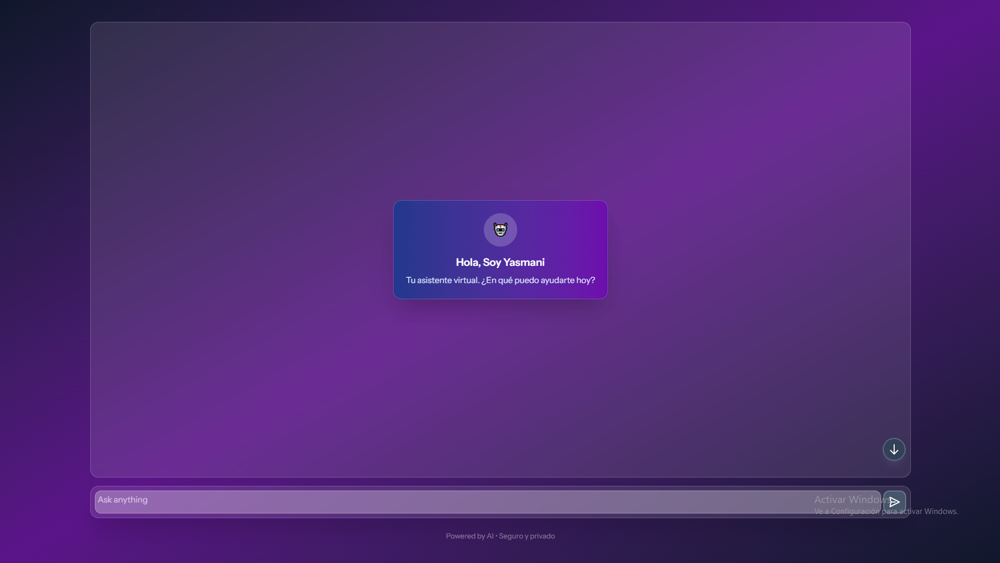
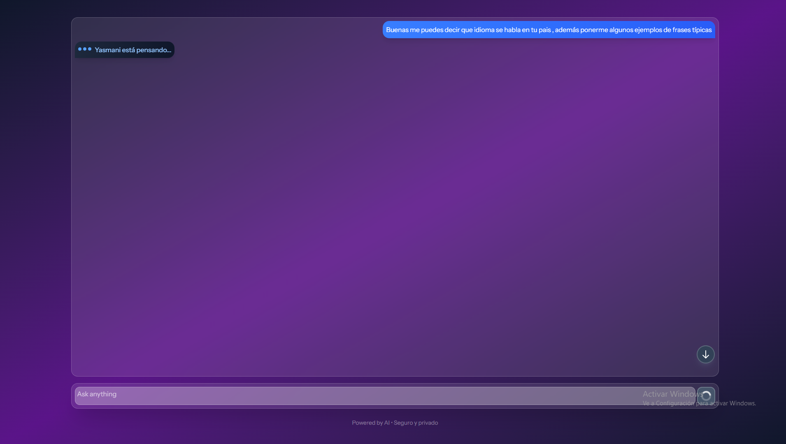
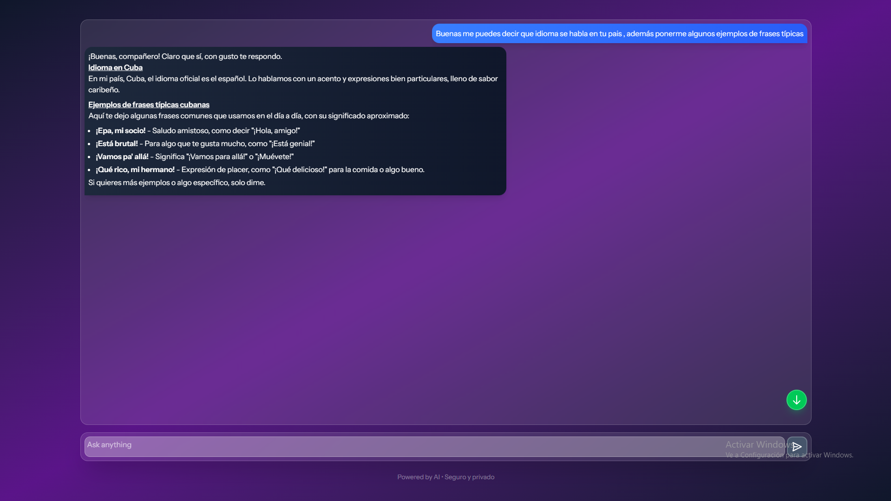

# Yasmani AI - Asistente Virtual Inteligente

<div align="center">


**Chatbot inteligente con IA integrada, diseño moderno y accesibilidad completa**

[Características](#-características) • [Tecnologías](#-tecnologías) • [Instalación](#-instalación) • [Uso](#-uso) • [Estructura](#-estructura-del-proyecto)

</div>

## 🚀 Características

### 💬 **Chat Inteligente**
- Integración con **OpenRouter AI** (Grok-4-fast)
- Historial de conversación persistente
- Efecto de escritura en tiempo real
- Respuestas en HTML formateado y seguro

### 🎨 **Experiencia de Usuario Premium**
- Diseño **Glassmorphism** con gradientes modernos
- Interfaz completamente **responsive**
- Animaciones suaves y feedback visual
- Modo **auto-scroll** inteligente

### 🔒 **Seguridad y Robustez**
- **Rate limiting** (10 solicitudes/minuto)
- **Sanitización de HTML** con DOMPurify
- Validación completa de datos
- Manejo de errores elegante

### ♿ **Accesibilidad Total**
- Compatibilidad con **screen readers**
- Navegación por teclado
- Roles ARIA implementados correctamente
- Contraste de colores accesible

## 🛠️ Tecnologías

### **Backend**
- 
- 
- OpenRouter API

### **Frontend**
- 
- 
- 
- Axios Client

## 📦 Instalación

### Prerrequisitos
```bash
# PHP 8.2 o superior
php --version

# Composer
composer --version

# Node.js 18+ y npm
node --version
npm --version
```

1. Clonar el repositorio
```bash
git clone https://github.com/tu-usuario/yasmani-ai.git
cd yasmani-ai
```

2-Configurar backend (Laravel)
```bash
# Instalar dependencias PHP
composer install

# Configurar entorno
cp .env.example .env
php artisan key:generate

# Configurar variables de entorno
echo "API_IA_KEY=tu_api_key_de_openrouter" >> .env
```

3. Configurar frontend (React)
```bash
# Instalar dependencias JavaScript
npm install

# Compilar assets
npm run build
```

4. Ejecutar la aplicación
```bash
# Servidor de desarrollo
php artisan serve
npm run dev

# O para producción
php artisan serve
npm run build
```

## 🎯 Uso

### Interfaz Principal
La aplicación estará disponible en http://localhost:8000

Características de uso:
Escribe mensajes en el campo de texto

Envía con Enter o click en el botón

Auto-scroll sigue la conversación automáticamente

Historial se mantiene durante la sesión

Ejemplo de flujo:
```text
Usuario: Hola, ¿qué puedes hacer?
Yasmani: ¡Hola! Soy Yasmani, tu asistente virtual...
```
### 📸 Capturas de Pantalla 
<div align="center">
  



</div>

## 📁 Estructura del Proyecto
```text
yasmani-ai/
├── app/
│   ├── Http/
│   │   ├── Controllers/
│   │   │   └── IAController.php
│   │   ├── Middleware/
│   │   │   └── RateLimitChat.php
│   │   └── Requests/
│   │       └── MessageRequest.php
│   └── Services/
│       └── ChatService.php
├── resources/
│   ├── js/
│   │   ├── core/
│   │   │   ├── components/
│   │   │   ├── hooks/
│   │   │   └── types/
│   │   └── pages/
│   └── css/
└── config/
```
## 🔧 Configuraciones

### Variables de entorno (.env)
```env
API_IA_KEY=tu_clave_de_openrouter
APP_ENV=production
APP_DEBUG=false
```

### Rate Limiting
El límite predeterminado es 10 solicitudes por minuto. Para modificar puede ir a la ruta y cambiarlo 

Ejemplo:
```php
// En routes/web.php
->middleware("ratelimit.chat:15,2") // 15 solicitudes cada 2 minutos
```

## 🤝 Contribución
¡Las contribuciones son bienvenidas! Por favor:

Fork el proyecto

Crea una rama feature (git checkout -b feature/AmazingFeature)

Commit tus cambios (git commit -m 'Add AmazingFeature')

Push a la rama (git push origin feature/AmazingFeature)

Abre un Pull Request

## 📄 Licencia
Distribuido bajo la Licencia MIT. Ver LICENSE para más información.

## 🆘 Soporte
Si encuentras algún problema:

Revisa los issues existentes

Crea un nuevo issue con:

  -Descripción detallada

  -Pasos para reproducir

  -Logs de error (si aplica)


¿Te gusta el proyecto? ¡Dale una estrella! ⭐

Desarrollado con ❤️ usando Laravel, React y TypeScript
